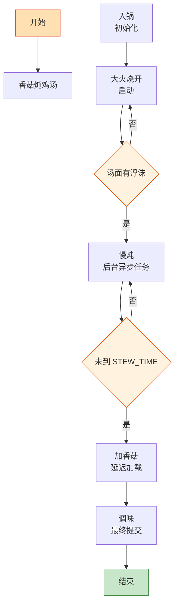

# 香菇炖鸡汤

> 📐 **度量标准**：本菜谱所有模糊表述（块/勺/火候/油温/熟度）均以[_spec.md（度量标准库）](_spec.md) 为准，可点击各章节锚点查看。
> 厨房里的 "后台异步任务"——鸡块+香菇扔进砂锅，小火慢炖 90 分钟，终态=汤色浓白、鸡肉酥烂，中途不用管。

## 流程总览（Flowchart）

## 常量定义（Constants）

| 常量名 | 值 | 来源 |
| --- | --- | --- |
| FIRE_HIGH | 大火(200℃+，火焰包住锅底) | [_spec §3](_spec.md#heat) |
| FIRE_LOW | 小火(120-140℃，火焰不舔锅底) | [_spec §3](_spec.md#heat) |
| STEW_TIME | 90min | — |
| SHIITAKE_TIME | 30min(香菇下锅后) | — |
| WATER | 6碗(1500ml，标准饭碗) | [_spec §2](_spec.md#measure) |
| SALT | 1小勺(5ml，咖啡勺) | [_spec §2](_spec.md#measure) |
| COOKING_WINE | 1勺(15ml，汤勺) | [_spec §2](_spec.md#measure) |
| GINGER | 5-6片(2-3mm厚，1元硬币厚度) | [_spec §1](_spec.md#size-spec) |

## 食材清单（Input）

| 食材 | 用量 | 切配规格 | 备注 |
| --- | --- | --- | --- |
| 土鸡/三黄鸡 | 半只(约600g) | 剁块(3cm见方，麻将牌) | [_spec §1](_spec.md#size-spec)，选土鸡更香 |
| 干香菇 | 8朵(约30g) | 泡发后切十字花刀 | 泡香菇水留用(过滤后入汤) |
| 姜 | 1块 | 切片(2-3mm厚，1元硬币厚度)，5-6片 | [_spec §1](_spec.md#size-spec) |
| 葱 | 2根 | 切段(4-5cm，手指长) | [_spec §1](_spec.md#size-spec)，出锅可撒葱花 |
| 料酒 | 1勺(15ml) | — | 焯水+去腥 |
| 盐 | 1小勺(5ml) | — | 出锅前放 |
| 清水 | 6碗(1500ml) | — | 含过滤后的香菇水 |

## 预处理（Preprocess）

- **焯水()**：调用 `[_spec §6](_spec.md#preprocess) 焯水()`——鸡块冷水下锅，加 COOKING_WINE(1勺料酒)+姜片(3片)，煮开撇去浮沫，捞出用温水冲洗干净。焯水是「编译期优化」，去除血水和杂质，避免汤浑浊。
- **泡发香菇**：干香菇用温水(40℃左右)浸泡 30min 至完全软透，泡香菇的水静置沉淀后，取上层清澈部分过滤备用——香菇水是天然鲜味剂(类似缓存的预计算结果)，倒掉等于浪费风味。
- **香菇切十字花刀**：泡发好的香菇在菌盖表面切十字花刀(深至菌肉 1/2)，便于炖煮时释放鲜味。

## 主流程（Main Logic）

1. **入锅（初始化）**：焯好的鸡块放入砂锅，加入姜片(剩余 2-3 片)、葱段(1 根)，倒入 WATER(6碗清水，含过滤后的香菇水)——这是初始化运行环境，所有原料一次性加载，水量一次加足，中途不加水(加水=热插拔，会导致温度骤降、汤味变淡)。

2. **大火烧开（启动）**：FIRE_HIGH(大火)烧开，用勺子再次撇去表面残余浮沫——浮沫是蛋白质变性后的杂质，类似编译期的 warning，必须清除否则汤色浑浊。`if 汤面有浮沫: 立即撇净`。

3. **慢炖（后台异步任务）**：转 FIRE_LOW(小火)，盖盖慢炖 STEW_TIME(90min)——慢炖=后台异步任务(Async Task)，主进程(灶火)持续低功耗运行，鸡肉中的氨基酸、脂肪、胶原蛋白持续溶出到汤中。终态=汤色浓白、鸡肉酥烂([_spec §5](_spec.md#done) 汤煮好)。`while 未到 STEW_TIME: 保持 FIRE_LOW 微沸`，中途不要频繁揭盖——每次揭盖=线程阻塞(Thread Block)，热量逃逸导致炖制时间延长 5-10min。

4. **加香菇（延迟加载）**：炖至 60min 时，加入切好花刀的香菇，继续小火炖 SHIITAKE_TIME(30min)——香菇是延迟加载模块(Lazy Loading)，太早放会煮烂失去口感、菌盖破碎，60min 时加入刚好释放鲜味又保持形态完整。

5. **调味（最终提交）**：出锅前 5min 加入 SALT(1小勺盐)，搅拌溶解——盐是最后提交的变更(Commit)，早放盐会使鸡肉蛋白质收缩、肉质发柴，晚放才能保证汤鲜肉嫩。捞出葱段(可留可弃)，撒葱花(可选)。

## 翻车预警（Bug Report）

- ⚠️ **Bug: 汤清淡不浓白** → 根因：火候不够(没保持微沸) or 时间不足 or 中途加了冷水。修复：小火保持汤面微沸(冒小泡)，炖足 90min，水量一次加足中途不加水。
- ⚠️ **Bug: 鸡肉发柴/塞牙** → 根因：早放盐 or 大火猛煮 or 鸡太老。修复：出锅前才放盐，全程小火微沸(大火只用于烧开阶段)，选 1 年以内的嫩鸡。
- ⚠️ **Bug: 汤浑浊/有腥味** → 根因：浮沫没撇干净 or 焯好的鸡用了冷水冲洗 or 鸡腹内血块没洗净。修复：烧开后仔细撇沫，焯好的鸡用温水冲洗(冷水会使肉表面急缩)，鸡块提前冲洗干净。

## 完成标准（Test Cases）

| 测试项 | 预期结果 | 判定方法 |
| --- | --- | --- |
| 视觉测试 | 汤色金黄浓白、香菇饱满完整、鸡肉块不碎、汤面无浮沫 | 肉眼观察 |
| 口感测试 | 鸡肉酥烂脱骨、香菇鲜香有嚼劲、汤味醇厚咸鲜、回甘 | 品尝 |
| 状态测试 | 鸡肉筷子可轻松插透([_spec §5](_spec.md#done) 肉类熟透)、汤面微沸无大泡、香菇咬开无硬芯 | 筷子插入+观察 |
| 时间测试 | 从入锅到出锅约 90-100min | 计时 |
