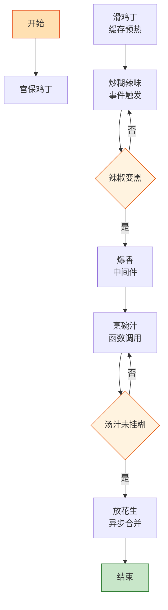

# 宫保鸡丁

> 📐 **度量标准**：本菜谱所有模糊表述（块/勺/火候/油温/熟度）均以[_spec.md（度量标准库）](_spec.md) 为准，可点击各章节锚点查看。
> 糊辣荔枝味的经典实现——鸡丁是主进程，花生米是异步任务，碗汁是配置文件，三者 merge 就是一盘宫保。

## 流程总览（Flowchart）

## 常量定义（Constants）

| 常量名 | 值 | 来源 |
| --- | --- | --- |
| FIRE_HIGH | 大火(200℃+，火焰包住锅底) | [_spec §3](_spec.md#heat) |
| FIRE_LOW | 小火(120-140℃，火焰不舔锅底) | [_spec §3](_spec.md#heat) |
| OIL_60 | 五六成热(120-160℃，竹筷快速冒细泡) | [_spec §4](_spec.md#oil) |
| SOY_SAUCE | 1勺(15ml，汤勺) | [_spec §2](_spec.md#measure) |
| VINEGAR | 1勺(15ml，汤勺) | [_spec §2](_spec.md#measure) |
| SUGAR | 1勺(15ml，汤勺) | [_spec §2](_spec.md#measure) |
| COOKING_WINE | 1勺(15ml，汤勺) | [_spec §2](_spec.md#measure) |
| SALT | 半小勺(2.5ml) | [_spec §2](_spec.md#measure) |
| STARCH | 1小勺(5ml) | [_spec §2](_spec.md#measure) |
| MARINATE_TIME | 15min | — |

## 食材清单（Input）

| 食材 | 用量 | 切配规格 | 备注 |
| --- | --- | --- | --- |
| 鸡腿肉 | 250g | 去骨切丁(1.5cm见方) | 鸡腿比鸡胸嫩，首选 |
| 花生米 | 50g | 整粒 | 炸熟备用，最后放 |
| 干辣椒 | 10个 | 剪段(2cm)，去籽 | 怕辣可减少 |
| 花椒 | 1小勺(5ml) | 整粒 | 麻味来源 |
| 葱 | 2根 | 切粒(5mm，米粒) | [_spec §1](_spec.md#size-spec) |
| 蒜 | 3瓣 | 切片(2-3mm厚，1元硬币厚度) | [_spec §1](_spec.md#size-spec) |
| 姜 | 1小块 | 切片(2-3mm厚) | [_spec §1](_spec.md#size-spec) |
| 生抽 | 1勺(15ml) | — | 调碗汁 |
| 醋 | 1勺(15ml) | — | 荔枝味（微酸）来源 |
| 糖 | 1勺(15ml) | — | 中和醋味 |
| 淀粉 | 1小勺(5ml) | 调水淀粉+腌肉 | [_spec §2](_spec.md#measure) |

## 预处理（Preprocess）

- **腌鸡丁（数据序列化）**：鸡丁中加入 SOY_SAUCE(半勺生抽)、COOKING_WINE(半勺料酒)、STARCH(半小勺淀粉)、SALT(少许)，抓匀至表面起黏，腌制 MARINATE_TIME(15min)。淀粉在鸡丁表面形成保护膜——这就是「序列化」，锁住内部水分，下锅后不易老。
- **炸花生（异步任务）**：冷油下花生米，FIRE_LOW(小火)慢慢炸至微黄酥脆（约 3-5min），捞出控油放凉——花生是异步任务，提前启动，最后合并结果，放凉后才脆。
- **配碗汁（配置文件）**：碗中加入生抽1勺、醋1勺、糖1勺、SALT(半小勺盐)、淀粉半小勺、清水2勺(30ml)，搅匀备用——碗汁是宫保鸡丁的「配置文件」，所有调味参数一次性写好，下锅时直接调用，避免爆炒时分神加调料。
- 干辣椒剪段去籽、花椒、葱粒、蒜片、姜片备好。

## 主流程（Main Logic）

1. **滑鸡丁（缓存预热）**：热锅倒油，油温 OIL_60(五六成热)，下腌好的鸡丁快速滑散——`for each 鸡丁 in 锅: 均匀受热`，滑至变色（约 1min），盛出备用。鸡丁表面淀粉糊化形成保护层，就像缓存预热，锁住肉汁。

2. **炒糊辣味（事件触发）**：锅留底油，转 FIRE_LOW(小火)，下干辣椒段和花椒，慢慢炒至辣椒呈枣红色、出香味（约 30s）——这一步是「事件监听器」，辣椒和花椒在低温下释放糊辣香气，`if 辣椒变黑: 立即下主料`，变黑就是糊了，会发苦。

3. **爆香（中间件）**：转 FIRE_HIGH(大火)，下葱粒、蒜片、姜片爆香（约 10s），立即倒入滑好的鸡丁，大火快炒 20s。

4. **烹碗汁（函数调用）**：倒入提前配好的碗汁——`调用 碗汁()`，大火快速翻炒 20s 让汤汁浓稠挂糊([_spec §5](_spec.md#done))，均匀包裹每一粒鸡丁。碗汁入锅后动作要快，`while 汤汁未挂糊: 翻炒; 一旦挂糊: break`。

5. **放花生（异步合并）**：关火，倒入炸好的花生米，快速翻匀立即出锅——花生必须最后放、关火后放，否则吸收汤汁变软就失去酥脆口感。这就像异步任务完成后合并结果，时机精确到秒。

## 翻车预警（Bug Report）

- ⚠️ **Bug: 花生不脆** → 根因：花生放太早 or 炸完没放凉 or 没关火就放。修复：冷油小火炸至微黄、捞出放凉、关火后最后放入、翻匀立即出锅。
- ⚠️ **Bug: 味道发苦** → 根因：干辣椒炒糊了 or 花椒炒太久。修复：FIRE_LOW(小火)慢炒、辣椒呈枣红色即下主料、不要等变黑。
- ⚠️ **Bug: 鸡丁发柴** → 根因：用了鸡胸肉 or 未腌淀粉 or 炒太久。修复：首选鸡腿肉、淀粉腌制、滑肉变色即盛出、合炒不超过 40s。
- ⚠️ **Bug: 没有荔枝味（酸甜平衡）** → 根因：醋糖比例不对。修复：醋:糖=1:1，碗汁提前配好，不要凭感觉加。

## 完成标准（Test Cases）

| 测试项 | 预期结果 | 判定方法 |
| --- | --- | --- |
| 视觉测试 | 鸡丁均匀裹汁、色泽红亮、干辣椒枣红、花生金黄、葱粒翠绿 | 肉眼观察 |
| 口感测试 | 鸡丁嫩滑、花生酥脆、糊辣微麻、酸甜平衡（荔枝味） | 品尝 |
| 状态测试 | 汤汁浓稠挂糊、盘底无大量游离汤汁、花生保持酥脆不回软 | 舀起观察+品尝花生 |
| 时间测试 | 从开火到出锅 ≤15min（不含腌制） | 计时 |
