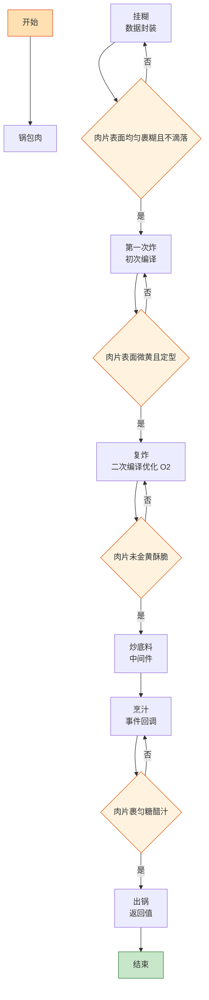

# 锅包肉

> 📐 **度量标准**：本菜谱所有模糊表述（块/勺/火候/油温/熟度）均以[_spec.md（度量标准库）](_spec.md) 为准，可点击各章节锚点查看。
> 东北菜的「编译器优化」——第一次炸是初次编译定型，复炸是二次编译优化(O2)，高温逼油让外壳达到酥脆的最优性能。

## 流程总览（Flowchart）

## 常量定义（Constants）

| 常量名 | 值 | 来源 |
| --- | --- | --- |
| FIRE_HIGH | 大火(200℃+，火焰包住锅底) | [_spec §3](_spec.md#heat) |
| FIRE_MEDIUM | 中火(160-180℃，火焰舔锅底一半) | [_spec §3](_spec.md#heat) |
| OIL_60 | 五六成热(120-160℃，竹筷快速冒细泡) | [_spec §4](_spec.md#oil) |
| OIL_70 | 七八成热(160-200℃，竹筷冒大泡油面冒烟) | [_spec §4](_spec.md#oil) |
| OIL_80 | 八成热以上(180-200℃，油面冒烟) | [_spec §4](_spec.md#oil) |
| SUGAR | 3勺(45ml，汤勺) | [_spec §2](_spec.md#measure) |
| VINEGAR | 2勺(30ml，汤勺) | [_spec §2](_spec.md#measure) |
| SOY_SAUCE | 半勺(7.5ml，半汤勺) | [_spec §2](_spec.md#measure) |
| SALT | 半小勺(2.5ml) | [_spec §2](_spec.md#measure) |
| COOKING_WINE | 1勺(15ml，汤勺) | [_spec §2](_spec.md#measure) |
| POTATO_STARCH | 100g | — | 挂糊用，土豆淀粉最脆 |

## 食材清单（Input）

| 食材 | 用量 | 切配规格 | 备注 |
| --- | --- | --- | --- |
| 猪里脊 | 300g | 切片(4-5mm厚，比1元硬币略厚) | 切稍厚片，炸后不缩 |
| 土豆淀粉 | 100g | 调糊 | 必须土豆淀粉，玉米淀粉不够脆 |
| 胡萝卜 | 半根 | 切丝(3mm宽×5cm长，火柴棍) | 点缀增甜 |
| 葱 | 1根 | 切丝(3mm宽×5cm长) | 点缀 |
| 姜 | 1小块 | 切丝(3mm宽×5cm长) | 去腥 |
| 蒜 | 3瓣 | 切丝(3mm宽×5cm长) | 增香 |
| 香菜 | 2根 | 切段(4-5cm) | 出锅点缀 |
| 白糖 | 3勺(45ml) | — | 糖醋汁主料 |
| 香醋 | 2勺(30ml) | — | 糖醋汁，用香醋 |
| 生抽 | 半勺(7.5ml) | — | 提鲜上色，少放 |
| 盐 | 半小勺(2.5ml) | — | 腌肉+调汁 |
| 料酒 | 1勺(15ml) | — | 腌肉去腥 |

## 预处理（Preprocess）

- **腌肉（编译期优化）**：里脊片中加入 SALT(半小勺盐)、COOKING_WINE(1勺料酒)，抓匀腌制 10min——去腥底味，这是「编译期优化」，提前处理好基础状态。
- **调糊（链接器配置）**：土豆淀粉 100g 加清水（约 1:1.2 比例），调成浓稠酸奶状的糊——糊的浓度是关键，太稀挂不住、太稠炸后硬。静置 10min 让淀粉充分吸水，这就像「链接器配置」，决定最终产物的外壳结构。
- **调糖醋汁（配置文件）**：碗中加入 SUGAR(3勺白糖)、VINEGAR(2勺香醋)、SOY_SAUCE(半勺生抽)、SALT(少许)、清水2勺(30ml)，搅匀备用——糖醋汁是「配置文件」，糖略多于醋（3:2）是锅包肉的酸甜比例。
- 胡萝卜丝、葱丝、姜丝、蒜丝、香菜段备好。

## 主流程（Main Logic）

1. **挂糊（数据封装）**：将腌好的里脊片放入调好的淀粉糊中，抓匀让每片肉均匀裹上一层糊——挂糊是「数据封装」，淀粉糊包裹肉片，炸后形成酥脆外壳。`if 肉片表面均匀裹糊且不滴落: 可以下锅`，糊太稀会滴落。

2. **第一次炸（初次编译）**：热锅倒油，油温 OIL_60(五六成热)，逐片下挂好糊的里脊片，炸至定型微黄（约 2-3min），捞出控油——第一次炸是「初次编译」，目标是定型炸熟，让外壳初步形成、内部熟透。`if 肉片表面微黄且定型: 捞出`，不要炸太黄，后面还要复炸。

3. **复炸（二次编译优化 O2）**：油温升至 OIL_80(八成热以上，油面冒烟)，将第一次炸好的肉片全部倒入，快速复炸 30-60s 至金黄酥脆，立即捞出——复炸是「二次编译优化(O2)」：高温短时间逼出肉片内部多余油脂，同时让外壳从软→酥脆达到最优性能。`while 肉片未金黄酥脆: 复炸; 一旦金黄: 立即捞出`，复炸时间不能长，否则会糊。这是锅包肉酥脆的核心步骤，不可省略。

4. **炒底料（中间件）**：锅留少许底油（或倒净油用锅的余油），转 FIRE_HIGH(大火)，下姜丝、蒜丝、胡萝卜丝爆香（约 10s）——底料是「中间件」，提供香气基底，大火快炒保持脆感。

5. **烹汁（事件回调）**：倒入提前配好的糖醋汁，大火快速翻炒至汤汁浓稠起泡（约 10s），立即倒入复炸好的肉片，快速翻匀让每片肉均匀裹上糖醋汁——烹汁是「事件回调」：炸好的肉片是事件源，糖醋汁是回调函数，在肉片最酥脆的时刻触发回调，激发出酸甜香气。动作必须快，`if 肉片裹匀糖醋汁: 立即出锅`，在锅里停留超过 30s 外壳就会回软。

6. **出锅（返回值）**：撒葱丝、香菜段，翻匀立即装盘。

## 翻车预警（Bug Report）

- ⚠️ **Bug: 外壳不脆/回软** → 根因：没复炸 or 复炸油温不够 or 烹汁后在锅里停留太久。修复：必须复炸、复炸油温 OIL_80(八成热以上)、复炸 30-60s、烹汁裹匀立即出锅不超过 30s。
- ⚠️ **Bug: 挂糊脱落** → 根因：糊太稀 or 油温太低下锅 or 肉片表面有水。修复：土豆淀粉调至浓稠酸奶状、油温 OIL_60 再下、肉片腌后沥干水、逐片下锅不要一起倒。
- ⚠️ **Bug: 味道太酸/太甜** → 根因：糖醋比例不对。修复：糖:醋=3:2（锅包肉标准比例）、提前配好糖醋汁、不要凭感觉加。
- ⚠️ **Bug: 肉片炸糊** → 根因：复炸时间太长 or 油温太高。修复：复炸 30-60s、金黄立即捞出、不要等颜色变深。
- ⚠️ **Bug: 外壳太硬** → 根因：糊太稠 or 淀粉放多了。修复：土豆淀粉:水≈1:1.2、调至浓稠酸奶状、不要太稠。

## 完成标准（Test Cases）

| 测试项 | 预期结果 | 判定方法 |
| --- | --- | --- |
| 视觉测试 | 肉片金黄、外壳酥脆、均匀裹有亮红糖醋汁、葱丝香菜点缀 | 肉眼观察 |
| 口感测试 | 外壳酥脆（咬开有咔嚓声）、肉片嫩滑、酸甜平衡（糖略多于醋） | 品尝（听酥脆声） |
| 状态测试 | 出锅后 5min 内外壳仍酥脆、盘底无大量游离汤汁、肉片不渗油 | 放置 5min 后品尝 |
| 时间测试 | 从挂糊到出锅 ≤25min | 计时 |
