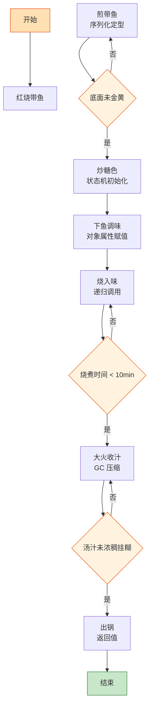

# 红烧带鱼

> 📐 **度量标准**：本菜谱所有模糊表述（块/勺/火候/油温/熟度）均以[_spec.md（度量标准库）](_spec.md) 为准，可点击各章节锚点查看。
> 海鲜里的「序列化→状态机」流水线——煎鱼(序列化定型)→炒糖色(状态机初始化)→烧入味(递归调用)→收汁(GC压缩)，25 分钟输出一份酱香浓郁、鱼肉细嫩的红烧带鱼。

## 流程总览（Flowchart）

## 常量定义（Constants）

| 常量名 | 值 | 来源 |
| --- | --- | --- |
| FIRE_LOW | 小火(120-140℃，火焰不舔锅底) | [_spec §3](_spec.md#heat) |
| FIRE_MID | 中火(160-180℃，火焰舔锅底一半) | [_spec §3](_spec.md#heat) |
| FIRE_HIGH | 大火(200℃+，火焰包住锅底) | [_spec §3](_spec.md#heat) |
| OIL_30 | 三四成热(90-120℃，竹筷缓慢冒小泡) | [_spec §4](_spec.md#oil) |
| OIL_60 | 五六成热(120-160℃，竹筷快速冒细泡) | [_spec §4](_spec.md#oil) |
| SOY_SAUCE | 2勺(30ml，汤勺) | [_spec §2](_spec.md#measure) |
| DARK_SOY | 半勺(7.5ml) | [_spec §2](_spec.md#measure) |
| COOKING_WINE | 2勺(30ml) | [_spec §2](_spec.md#measure) |
| SALT | 半小勺(2.5ml) | [_spec §2](_spec.md#measure) |
| SUGAR_CANDY | 15g（冰糖） | — |
| VINEGAR | 1勺(15ml) | [_spec §2](_spec.md#measure) |
| BRAISE_TIME | 10min | — |
| WATER_BOWL | 1碗(250ml，标准饭碗) | [_spec §2](_spec.md#measure) |
| STARCH_WATER | 淀粉:水=1:3 | [_spec §6](_spec.md#preprocess) |

## 食材清单（Input）

| 食材 | 用量 | 切配规格 | 备注 |
| --- | --- | --- | --- |
| 带鱼 | 2条(约500g) | 去头尾内脏，切段(4-5cm，手指长) | [_spec §1](_spec.md#size-spec)，选银鳞完整的 |
| 冰糖 | 15g | 整粒 | 炒糖色专用 |
| 姜 | 1块 | 切片(2-3mm厚，1元硬币) | [_spec §1](_spec.md#size-spec) |
| 蒜 | 4瓣 | 切片(2-3mm) | [_spec §1](_spec.md#size-spec) |
| 葱 | 2根 | 切段(4-5cm)+葱花 | [_spec §1](_spec.md#size-spec) |
| 八角 | 1颗 | 整粒 | |
| 干辣椒 | 2个 | 整只 | 可选，微辣 |
| 生抽 | 2勺(30ml) | — | [_spec §2](_spec.md#measure) |
| 老抽 | 半勺(7.5ml) | — | [_spec §2](_spec.md#measure) |
| 料酒 | 2勺(30ml) | — | [_spec §2](_spec.md#measure) |
| 醋 | 1勺(15ml) | — | [_spec §2](_spec.md#measure)，去腥提鲜 |
| 盐 | 半小勺(2.5ml) | — | [_spec §2](_spec.md#measure) |

## 预处理（Preprocess）

- 带鱼去头尾、内脏、黑膜（黑膜是腥味主要来源，必须刮干净），切段(4-5cm)，洗净沥干。
- **腌鱼（编译期优化）**：带鱼段加入 COOKING_WINE(1勺料酒)、姜片、少许盐，抓匀腌制 10min。料酒腌制是「编译期优化」——在煎之前就去除腥味，下锅后不会因高温释放腥气。
- 带鱼段表面**薄薄拍一层淀粉**（可选，防止煎鱼破皮）。
- 姜切片，蒜切片，葱切段+切葱花，所有 Input 就绪。

## 主流程（Main Logic）

1. **煎带鱼（序列化定型）**：热锅倒油，油温 OIL_60(五六成热)，将带鱼段**皮朝下**逐块放入，不要急着翻动——`while 底面未金黄: 不要翻; 一旦金黄: 翻面`。煎至两面金黄（每面约 2-3min），盛出备用。煎鱼是**序列化定型**：高温让鱼皮表面蛋白质凝固(序列化编码)，形成金黄酥脆的外壳(稳定的数据结构)，后续烧煮时鱼肉不易碎。`if 鱼皮粘锅破皮: 根因是油温不够 or 翻动太早`。

2. **炒糖色（状态机初始化）**：锅留底油，油温 OIL_30(三四成热)，下 SUGAR_CANDY(15g冰糖)，调用 `[_spec §6](_spec.md#preprocess) 炒糖色()`——FIRE_LOW(小火)熬至冰糖融化，颜色经历 `浅黄→琥珀→枣红→冒细密小泡` 的状态流转。终态判定：枣红色+冒细密小泡，此时立即进入下一步。这是整道菜的**状态机初始化**，糖色决定了红烧的色泽基类。

3. **下鱼调味（对象属性赋值）**：糖色到达终态，放入煎好的带鱼段，轻轻翻动让鱼段裹上糖色。加入姜片、蒜片、葱段、八角、干辣椒爆香，倒入 COOKING_WINE(1勺料酒)、VINEGAR(1勺醋)、SOY_SAUCE(2勺生抽)、DARK_SOY(半勺老抽)，轻轻翻匀。调味是「对象属性赋值」：给带鱼(核心对象)设置 flavor 属性，醋和料酒的组合是关键——醋去腥提鲜，料酒增香。

4. **烧入味（递归调用）**：加入 WATER_BOWL(1碗热水)，水量没过带鱼一半，大火烧开后转 FIRE_MID(中火)，盖盖烧 BRAISE_TIME(10min)。烧入味是**递归调用**——汤汁(调用栈)不断渗透鱼肉(递归处理每个细胞)，每 2min 将鱼段轻轻翻一次面(递归深度+1)，让两面均匀入味。`while 烧煮时间 < 10min: 保持中火; 每 2min 翻面一次`。

5. **大火收汁（GC 压缩）**：10min 后，拣出葱姜八角，转 FIRE_HIGH(大火)收汁。`while 汤汁未浓稠挂糊: 轻翻收汁`——收汁是**垃圾回收压缩阶段**，把多余汤汁(内存碎片)压缩成浓稠酱汁(紧凑对象)。需要时淋入 STARCH_WATER(淀粉:水=1:3)勾芡至挂糊([_spec §5](_spec.md#done))。加入 SALT(半小勺盐)最后调味。

6. **出锅（返回值）**：装盘，撒葱花，带鱼色泽红亮、酱香浓郁、鱼肉细嫩。

## 翻车预警（Bug Report）

- ⚠️ **Bug: 煎鱼破皮、鱼肉碎** → 根因：油温不够 or 翻动太早 or 鱼表面有水。修复：油温 OIL_60 再下鱼、底面金黄再翻、鱼段沥干或拍薄淀粉、下锅后不要急着动。
- ⚠️ **Bug: 带鱼腥味重** → 根因：黑膜没刮干净 or 没腌料酒 or 没放醋。修复：内脏黑膜必须刮干净、料酒腌制 10min、烧煮时加 1 勺醋去腥提鲜。
- ⚠️ **Bug: 鱼肉烧老、发柴** → 根因：烧煮时间太长 or 火太大。修复：中火烧 10min 即可，带鱼易熟，`while 未入味: 烧; 一旦入味: 收汁出锅`，不要过度烧煮。

## 完成标准（Test Cases）

| 测试项 | 预期结果 | 判定方法 |
| --- | --- | --- |
| 视觉测试 | 带鱼色泽红亮均匀、鱼段完整不碎、酱汁浓稠、葱花翠绿 | 肉眼观察 |
| 口感测试 | 鱼肉细嫩不柴、酱香浓郁、咸鲜微甜、无腥味 | 品尝 |
| 状态测试 | 鱼段完整不碎、酱汁挂勺、盘底无多余清汤 | 筷子轻夹+倾斜盘观察 |
| 时间测试 | 从开火到出锅 ≤25min | 计时 |
