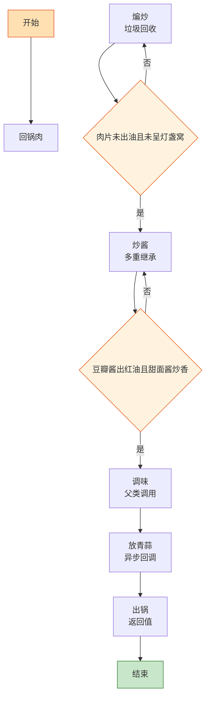

# 回锅肉

> 📐 **度量标准**：本菜谱所有模糊表述（块/勺/火候/油温/熟度）均以[_spec.md（度量标准库）](_spec.md) 为准，可点击各章节锚点查看。
> 川菜之首——先煮后炒，「回锅」就是二次编译：第一次煮是初始化对象，第二次煸炒是垃圾回收释放油脂，最终输出一盘灯盏窝。

## 流程总览（Flowchart）

## 常量定义（Constants）

| 常量名 | 值 | 来源 |
| --- | --- | --- |
| FIRE_HIGH | 大火(200℃+，火焰包住锅底) | [_spec §3](_spec.md#heat) |
| FIRE_MEDIUM | 中火(160-180℃，火焰舔锅底一半) | [_spec §3](_spec.md#heat) |
| FIRE_LOW | 小火(120-140℃，火焰不舔锅底) | [_spec §3](_spec.md#heat) |
| SOY_SAUCE | 1勺(15ml，汤勺) | [_spec §2](_spec.md#measure) |
| COOKING_WINE | 1勺(15ml，汤勺) | [_spec §2](_spec.md#measure) |
| SUGAR | 半小勺(2.5ml) | [_spec §2](_spec.md#measure) |
| SALT | 少许(<半小勺) | [_spec §2](_spec.md#measure) |
| BOIL_TIME | 20-25min | — |

## 食材清单（Input）

| 食材 | 用量 | 切配规格 | 备注 |
| --- | --- | --- | --- |
| 带皮五花肉 | 300g | 整块煮后切片(2-3mm厚，1元硬币厚度) | [_spec §1](_spec.md#size-spec)，选肥瘦相间三层肉 |
| 青蒜（蒜苗） | 3根 | 切斜段(4-5cm，手指长) | [_spec §1](_spec.md#size-spec)，回锅肉标配 |
| 郫县豆瓣酱 | 1大勺(15ml，火锅勺) | 剁细 | 必须剁细 |
| 甜面酱 | 1小勺(5ml) | — | 增加酱香和回甜 |
| 豆豉 | 1小勺(5ml) | 剁细 | 可选，增香 |
| 生抽 | 1勺(15ml) | — | 提鲜 |
| 料酒 | 1勺(15ml) | — | 煮肉+调味 |
| 姜 | 1小块 | 切片(2-3mm厚) | 煮肉用 |
| 葱 | 2根 | 切段(4-5cm) | 煮肉用+可选 |
| 花椒 | 少许 | 整粒 | 煮肉用 |

## 预处理（Preprocess）

- **煮肉（对象初始化）**：五花肉整块冷水下锅，加入姜片、葱段、花椒、COOKING_WINE(1勺料酒)，FIRE_HIGH(大火)烧开后转 FIRE_MEDIUM(中火)煮 BOIL_TIME(20-25min)，至筷子能轻松插透、无血水渗出([_spec §5](_spec.md#done))，捞出放凉——煮肉是「初始化对象」，先让肉从生→熟透的状态转换，同时去腥定型。`if 筷子插透无血水: 捞出`，这是初始化完成的标志。
- 肉放凉至不烫手后切片(2-3mm厚)——必须放凉再切，热刀切会碎。
- 豆瓣酱、豆豉分别剁细；青蒜切斜段（蒜白和蒜叶分开放）。

## 主流程（Main Logic）

1. **煸炒（垃圾回收）**：热锅不放油（或极少油），下五花肉片，转 FIRE_MEDIUM(中火)慢慢煸炒——这就是「垃圾回收(GC)」：`while 肉片未出油且未呈灯盏窝: 持续翻动煸出油脂`，持续 3-5min，直到肉片边缘微卷、呈「灯盏窝」状、肥肉变透明、煸出大量油脂。油脂就是需要回收的「冗余内存」，GC 完成后肉片不腻且香。`if 肉片呈灯盏窝且出油: 将多余油倒出留少许`，倒出的油可以留着炒素菜。

2. **炒酱（多重继承）**：将肉片拨到锅边，锅留底油（煸出的油），转 FIRE_LOW(小火)，下剁细的豆瓣酱炒出红油（约 1min），再下甜面酱、豆豉炒香（约 30s）——豆瓣酱和甜面酱是「多重继承」：豆瓣酱继承了咸辣红亮，甜面酱继承了酱香回甜，两者融合产出回锅肉独有的复合风味。`if 豆瓣酱出红油且甜面酱炒香: 与肉片 merge`。

3. **调味（父类调用）**：转 FIRE_HIGH(大火)，将肉片与酱料翻炒均匀，加入 SOY_SAUCE(1勺生抽)、SUGAR(半小勺糖提鲜)、COOKING_WINE(半勺料酒)，大火快炒 20s。调味遵循「面向对象继承」：底味(豆瓣酱咸辣)→主味(甜面酱酱香)→顶味(糖+生抽提鲜)，层层叠加。

4. **放青蒜（异步回调）**：先下蒜白部分炒 10s，再下蒜叶部分，大火快炒 10s 至蒜叶断生——颜色变深变软、无生涩味([_spec §5](_spec.md#done))。青蒜分两次放是「分级回调」：蒜白难熟先下锅，蒜叶易熟后下锅，保证同步断生。

5. **出锅（返回值）**：装盘，盘底应有少许红油，但无大量游离油。

## 翻车预警（Bug Report）

- ⚠️ **Bug: 肉片太腻** → 根因：煸炒时间不够、油脂未煸出。修复：FIRE_MEDIUM(中火)煸至灯盏窝状、倒出多余油、煸炒不少于 3min。
- ⚠️ **Bug: 肉片碎不成形** → 根因：肉没煮透就切 or 热刀切 or 切太薄。修复：煮至筷子插透、放凉后再切、切片 2-3mm 厚。
- ⚠️ **Bug: 味道发苦** → 根因：豆瓣酱炒糊了。修复：FIRE_LOW(小火)炒豆瓣酱、刚出红油即可、不要等变黑。
- ⚠️ **Bug: 青蒜变黄烂** → 根因：炒太久。修复：大火快炒、蒜白先下蒜叶后下、断生即止。

## 完成标准（Test Cases）

| 测试项 | 预期结果 | 判定方法 |
| --- | --- | --- |
| 视觉测试 | 肉片呈灯盏窝状、边缘微卷、色泽红亮、青蒜翠绿 | 肉眼观察 |
| 口感测试 | 肉片肥而不腻、瘦而不柴、酱香浓郁、咸鲜微辣回甜 | 品尝 |
| 状态测试 | 盘底留少许红油、无大量游离油、肉片干爽不渗油 | 倾斜盘子观察 |
| 时间测试 | 从煮肉到出锅 ≤40min | 计时 |
