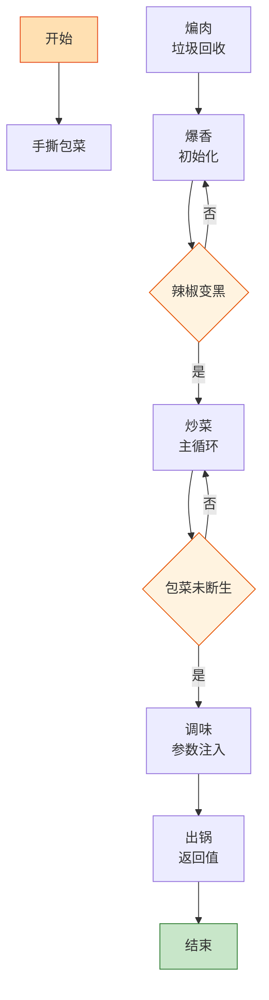

# 手撕包菜

> 📐 **度量标准**：本菜谱所有模糊表述（块/勺/火候/油温/熟度）均以[_spec.md（度量标准库）](_spec.md) 为准，可点击各章节锚点查看。
> 非结构化数据的最佳实践——不用刀切，用手撕出不规则碎片，大火干煸逼出水分，锅气就是这道菜的编译优化。

## 流程总览（Flowchart）

## 常量定义（Constants）

| 常量名 | 值 | 来源 |
| --- | --- | --- |
| FIRE_HIGH | 大火(200℃+，火焰包住锅底) | [_spec §3](_spec.md#heat) |
| FIRE_MID | 中火(160-180℃，火焰舔锅底一半) | [_spec §3](_spec.md#heat) |
| OIL_60 | 五六成热(120-160℃，竹筷快速冒细泡) | [_spec §4](_spec.md#oil) |
| SALT | 半小勺(2.5ml，咖啡勺) | [_spec §2](_spec.md#measure) |
| SOY_SAUCE | 1勺(15ml，汤勺) | [_spec §2](_spec.md#measure) |
| VINEGAR | 1勺(15ml，汤勺) | [_spec §2](_spec.md#measure) |
| OYSTER_SAUCE | 1勺(15ml，汤勺) | [_spec §2](_spec.md#measure) |
| DRIED_CHILI | 5个 | — |
| SICHUAN_PEPPER | 1小勺(5ml) | [_spec §2](_spec.md#measure) |

## 食材清单（Input）

| 食材 | 用量 | 切配规格 | 备注 |
| --- | --- | --- | --- |
| 包菜(圆白菜) | 半颗(约400g) | 手撕成不规则碎片(约5cm) | 不用刀切，手撕断面更吸味 |
| 蒜 | 5瓣 | 切末(<2mm，细沙) | [_spec §1](_spec.md#size-spec) |
| 姜 | 3片 | 切末(<2mm) | [_spec §1](_spec.md#size-spec) |
| 干辣椒 | 5个 | 切段(1cm) | 怕辣可减 |
| 五花肉 | 50g | 切片(2-3mm厚，1元硬币厚度) | [_spec §1](_spec.md#size-spec)；可选，增香 |
| 花椒 | 1小勺(5ml) | 整粒 | 增麻香 |

## 预处理（Preprocess）

- **手撕包菜（非结构化处理）**：包菜逐叶剥下，去掉硬菜梗，用手撕成约 5cm 不规则碎片——手撕的断面粗糙不平，比刀切更易吸附调料，这就是「非结构化数据表面积更大」的烹饪版。撕好后清水冲洗，**彻底沥干**，带水下锅会导致出水变软。
- 五花肉切片(2-3mm)，蒜切末、姜切末、干辣椒切段。所有 Input 就绪后再开火。

## 主流程（Main Logic）

1. **煸肉（垃圾回收）**：热锅不放油，下五花肉片，FIRE_MID(中火)慢慢煸炒出油脂——这就像「垃圾回收」，把肉里多余的脂肪（无用内存）煸出来，变成炒菜的底油。煸至肉片微卷焦黄（约 2min），出油充足。

2. **爆香（初始化）**：转 FIRE_HIGH(大火)，下花椒粒、干辣椒段、姜末、蒜末爆香约 20s——`if 辣椒变黑: 立即下菜`，辣椒焦了就是 null pointer。这一步是「初始化函数」，麻辣蒜香必须先释放到油里。

3. **炒菜（主循环）**：下沥干的包菜碎片，FIRE_HIGH(大火)快速翻炒——这就像 `for` 循环遍历非结构化数组，每片包菜都要均匀沾油受热。`while 包菜未断生: 大火翻炒`，断生标准为颜色变深变软、无生涩味([_spec §5](_spec.md#done))，约 2min。全程大火，`if 包菜出水: 继续大火收干`，出水就是过度渲染。

4. **调味（参数注入）**：沿锅边淋 VINEGAR(1勺醋)——醋遇热锅壁瞬间汽化，醋香渗入菜中，这是「边沿触发」。加入 SOY_SAUCE(1勺生抽)、OYSTER_SAUCE(1勺蚝油)、SALT(半小勺盐)，大火翻炒 20s 均匀。调味层次遵循「面向对象继承」：底味(盐)→主味(生抽+蚝油)→顶味(醋香+麻辣)，子类继承父类风味再叠加。

5. **出锅（返回值）**：装盘，锅气十足。

## 翻车预警（Bug Report）

- ⚠️ **Bug: 包菜出水变软塌** → 根因：菜没沥干 or 小火慢炒 or 炒太久。修复：彻底沥干、FIRE_HIGH(大火)快炒、断生即止，`while 未断生: 炒; 一旦断生: break`。
- ⚠️ **Bug: 没有锅气、味道平淡** → 根因：火不够大 or 醋没沿锅边淋。修复：FIRE_HIGH(大火)全程，醋必须沿锅边淋让其汽化，锅气=高温+快速+醋香。
- ⚠️ **Bug: 辣椒花椒发苦** → 根因：爆香时间太长导致焦糊。修复：爆香 20s 即可，辣椒变色即下菜，焦糊的辣椒花椒必须丢弃。

## 完成标准（Test Cases）

| 测试项 | 预期结果 | 判定方法 |
| --- | --- | --- |
| 视觉测试 | 包菜翠绿微焦、肉片金黄、干辣椒红亮 | 肉眼观察 |
| 口感测试 | 包菜脆嫩断生、麻辣鲜香、微醋酸爽 | 品尝 |
| 状态测试 | 盘底无大量积水、仅留薄油、锅气浓郁 | 倾斜盘子观察 |
| 时间测试 | 从开火到出锅 ≤15min | 计时 |
