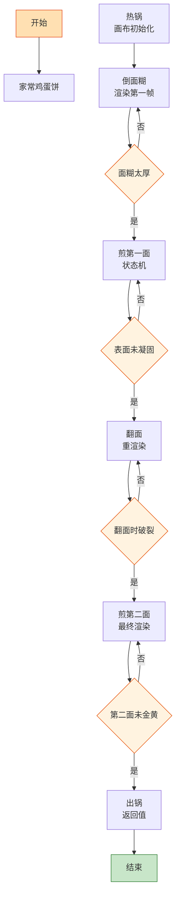

# 家常鸡蛋饼

> 📐 **度量标准**：本菜谱所有模糊表述（块/勺/火候/油温/熟度）均以[_spec.md（度量标准库）](_spec.md) 为准，可点击各章节锚点查看。
> 前端渲染的最小闭环——面糊（样式表）倒入热锅（画布），小火慢煎（逐帧渲染），两面金黄就是编译通过。

## 流程总览（Flowchart）

## 常量定义（Constants）

| 常量名 | 值 | 来源 |
| --- | --- | --- |
| FIRE_LOW | 小火(120-140℃，火焰不舔锅底) | [_spec §3](_spec.md#heat) |
| FIRE_MID | 中火(160-180℃，火焰舔锅底一半) | [_spec §3](_spec.md#heat) |
| OIL_60 | 五六成热(120-160℃，竹筷快速冒细泡) | [_spec §4](_spec.md#oil) |
| SALT | 半小勺(2.5ml，咖啡勺) | [_spec §2](_spec.md#measure) |
| FLOUR | 100g(约普通瓷碗半碗) | — |
| EGG | 2个 | — |
| WATER | 150ml(约半碗多) | — |
| SCALLION | 2根 | — |
| PAN_SIZE | 20cm平底锅 | — |

## 食材清单（Input）

| 食材 | 用量 | 切配规格 | 备注 |
| --- | --- | --- | --- |
| 鸡蛋 | 2个 | 打散 | — |
| 面粉 | 100g | — | 普通中筋面粉 |
| 清水 | 150ml | — | 分次加入，控制面糊稠度 |
| 葱 | 2根 | 切粒(5mm，米粒) | [_spec §1](_spec.md#size-spec) |
| 盐 | 半小勺(2.5ml) | — | [_spec §2](_spec.md#measure) |
| 食用油 | 适量 | — | 刷锅用 |

## 预处理（Preprocess）

- **调面糊（编译期构建）**：面粉 100g 倒入大碗，分次加入清水 150ml，边加边用筷子顺一个方向搅拌——这就像「构建依赖」，水要分次加避免面疙瘩，搅拌至面糊顺滑无颗粒、提起筷子面糊呈细线流下（类似酸奶稠度）。`if 面糊太稠: 加 1勺(15ml)水; if 太稀: 加 1勺面粉`，稠度是关键参数。
- 鸡蛋打散倒入面糊，加 SALT(半小勺盐)、葱粒，搅拌均匀。面糊静置 5min 让面筋松弛——这是「编译缓存」，静置后面糊更细腻。

## 主流程（Main Logic）

1. **热锅（画布初始化）**：平底锅(20cm)刷一层薄油，FIRE_MID(中火)预热 30s——锅必须均匀受热，这就像「画布初始化」，冷锅倒面糊会粘底。转 FIRE_LOW(小火)，准备倒入面糊。

2. **倒面糊（渲染第一帧）**：舀 1 勺(15ml)面糊倒入锅中心，立即转动锅身让面糊均匀摊开成圆形——这就像 `for` 循环逐行渲染画布，面糊必须均匀覆盖锅底，厚度约 2-3mm（1 元硬币厚度，[_spec §1](_spec.md#size-spec)）。`if 面糊太厚: 下次减量; if 有破洞: 补少许面糊`。

3. **煎第一面（状态机）**：FIRE_LOW(小火)慢煎约 2min——鸡蛋饼从「液态」转为「固态」是一个状态机：液态→表面凝固→边缘微黄→可翻面。`while 表面未凝固: 不要翻面`，强行翻面就是空指针异常。判定标准：边缘微微翘起、表面蛋液完全凝固([_spec §5](_spec.md#done) 蛋类凝固)。

4. **翻面（重渲染）**：用锅铲从边缘轻轻铲起，手腕翻转 180°——这就像「双缓冲渲染」，第一面已经渲染完成，翻到背面继续渲染第二帧。`if 翻面时破裂: 说明火太大或翻太早，下次小火多煎 30s`。

5. **煎第二面（最终渲染）**：FIRE_LOW(小火)继续煎约 1.5min，至两面金黄——`while 第二面未金黄: 继续煎`，终态是两面金黄微焦、香气浓郁。可在表面刷少许油增加酥脆度。

6. **出锅（返回值）**：装盘，可切块(2cm见方，骰子大)或直接整张上桌。重复步骤 2-5 直至面糊用完（约 3-4 张）。

## 翻车预警（Bug Report）

- ⚠️ **Bug: 饼粘锅、翻面就碎** → 根因：锅没预热 or 火太大 or 面糊太稀。修复：FIRE_MID(中火)预热 30s 再转小火、面糊稠度如酸奶、表面完全凝固再翻面。
- ⚠️ **Bug: 饼中间厚边缘薄 or 有破洞** → 根因：倒面糊后没及时转锅 or 面糊量不对。修复：倒面糊后立即转动锅身摊匀，每张用 1 勺(15ml)面糊，破洞处补少许。
- ⚠️ **Bug: 饼外面焦了里面还没熟** → 根因：火太大。修复：全程 FIRE_LOW(小火)，小火慢煎是这道菜的核心约束，急不得。

## 完成标准（Test Cases）

| 测试项 | 预期结果 | 判定方法 |
| --- | --- | --- |
| 视觉测试 | 两面金黄微焦、圆形完整、葱粒均匀分布 | 肉眼观察 |
| 口感测试 | 外微脆内软嫩、蛋香浓郁、咸淡适中 | 品尝 |
| 状态测试 | 饼体完整不碎、厚度均匀(2-3mm)、无夹生 | 切开观察截面 |
| 时间测试 | 从调面糊到煎完 ≤15min | 计时 |
