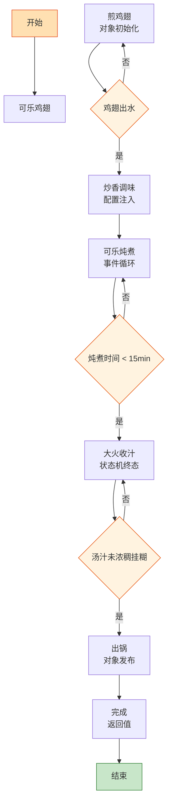

# 可乐鸡翅

> 📐 **度量标准**：本菜谱所有模糊表述（块/勺/火候/油温/熟度）均以[_spec.md（度量标准库）](_spec.md) 为准，可点击各章节锚点查看。
> 新手厨房里的「状态机终态课」——煎翅(对象初始化)→可乐炖煮(事件循环)→收汁(状态机终态: 浓稠挂糊)，零失败率的入门级硬菜，20 分钟编译通过。

## 流程总览（Flowchart）

## 常量定义（Constants）

| 常量名 | 值 | 来源 |
| --- | --- | --- |
| FIRE_LOW | 小火(120-140℃，火焰不舔锅底) | [_spec §3](_spec.md#heat) |
| FIRE_MID | 中火(160-180℃，火焰舔锅底一半) | [_spec §3](_spec.md#heat) |
| FIRE_HIGH | 大火(200℃+，火焰包住锅底) | [_spec §3](_spec.md#heat) |
| OIL_60 | 五六成热(120-160℃，竹筷快速冒细泡) | [_spec §4](_spec.md#oil) |
| SOY_SAUCE | 1.5勺(22.5ml，汤勺) | [_spec §2](_spec.md#measure) |
| COOKING_WINE | 1勺(15ml) | [_spec §2](_spec.md#measure) |
| SALT | 半小勺(2.5ml) | [_spec §2](_spec.md#measure) |
| COLA | 1罐(330ml) | — | 普通可乐，不要无糖 |
| BRAISE_TIME | 15min | — |
| STARCH_WATER | 淀粉:水=1:3 | [_spec §6](_spec.md#preprocess) |

## 食材清单（Input）

| 食材 | 用量 | 切配规格 | 备注 |
| --- | --- | --- | --- |
| 鸡中翅 | 8个(约400g) | 两面各划 2 刀(深至骨) | 选大小均匀的 |
| 可乐 | 1罐(330ml) | — | 普通含糖可乐 |
| 姜 | 1块 | 切片(2-3mm厚，1元硬币) | [_spec §1](_spec.md#size-spec) |
| 葱 | 2根 | 切段(4-5cm)+葱花 | [_spec §1](_spec.md#size-spec) |
| 蒜 | 3瓣 | 切片(2-3mm) | [_spec §1](_spec.md#size-spec) |
| 生抽 | 1.5勺(22.5ml) | — | [_spec §2](_spec.md#measure) |
| 料酒 | 1勺(15ml) | — | [_spec §2](_spec.md#measure) |
| 盐 | 半小勺(2.5ml) | — | [_spec §2](_spec.md#measure) |
| 白芝麻 | 少许 | 整粒 | 可选，装饰用 |

## 预处理（Preprocess）

- 鸡翅洗净，两面各划 2 刀（深至骨）——划刀是**端口暴露**，让调味料能通过切口(端口)渗透到鸡肉内部。
- 调用 `[_spec §6](_spec.md#preprocess) 焯水()`：鸡翅冷水下锅，加姜片、COOKING_WINE(半勺料酒)，煮开撇去浮沫，捞出用温水冲洗沥干。焯水是「垃圾回收」——清理血水和杂质，避免后续汤色浑浊。
- 姜切片，蒜切片，葱切段+切葱花，所有 Input 就绪。

## 主流程（Main Logic）

1. **煎鸡翅（对象初始化）**：热锅倒少许油，油温 OIL_60(五六成热)，将鸡翅**皮朝下**平铺放入，FIRE_MID(中火)煎至一面金黄（约 2min），翻面煎另一面。煎鸡翅是**对象初始化**——高温让鸡皮(对象外壳)煎至金黄酥脆，鸡油(对象内部资源)溢出，为后续炖煮提供风味基类。`for 每只鸡翅: 两面煎至金黄; if 鸡翅出水: 继续煎(水分蒸发=对象初始化中)`。煎好盛出备用。

2. **炒香调味（配置注入）**：锅留底油，下姜片、蒜片、葱段爆香（约 30s），加入 SOY_SAUCE(1.5勺生抽)、COOKING_WINE(半勺料酒)，翻炒均匀。调味是「配置注入」：姜蒜葱(配置项)→生抽料酒(运行时环境)→鸡翅(核心对象)，注入咸鲜底味。

3. **可乐炖煮（事件循环）**：倒入 COLA(1罐330ml可乐)，水量没过鸡翅，大火烧开后转 FIRE_LOW(小火)，盖盖炖煮 BRAISE_TIME(15min)。可乐炖煮是**事件循环**——可乐中的糖分(事件源)在小火中持续焦化，给鸡翅上色增甜，`while 炖煮时间 < 15min: 保持小火微沸; 每 5min 翻一次面`。可乐的气泡(事件信号)在炖煮中逐渐消失，糖分浓缩，鸡翅从白色→浅棕→红亮的状态渐变。**必须用普通含糖可乐**，无糖可乐没有糖分(事件源缺失)，无法收汁上色。

4. **大火收汁（状态机终态）**：15min 后，鸡翅已熟透（筷子能轻松插透、无血水渗出，[_spec §5](_spec.md#done)），拣出葱姜蒜，转 FIRE_HIGH(大火)收汁。`while 汤汁未浓稠挂糊: 翻动收汁; 一旦浓稠挂糊: 立即关火`——收汁是**状态机终态判断**！`状态: 可乐液体→微沸浓缩→变稠→浓稠挂糊(终态)`，终态是汤汁浓稠可挂勺([_spec §5](_spec.md#done))，能均匀裹在鸡翅表面。不到终态不收火，过了终态(发焦发苦)就是 fatal error。加入 SALT(半小勺盐)最后调味（盐提甜，「延迟初始化」原则）。

5. **出锅（对象发布）**：将鸡翅整齐码入盘中，淋上锅中的浓稠酱汁，撒葱花和白芝麻（可选）。鸡翅色泽红亮、酱汁浓郁——这是**对象发布到生产环境**，孩子最爱的下饭菜。

6. **完成（返回值）**：立即上桌，鸡翅甜咸适口、肉质嫩滑、酱汁浓郁可拌饭。

## 翻车预警（Bug Report）

- ⚠️ **Bug: 收汁发苦、鸡翅发黑** → 根因：收汁火太大 or 收过头 or 可乐本身焦糖色重。修复：收汁时盯紧状态机，浓稠挂糊立即关火；`if 颜色发黑发苦: 无法挽救，下次注意`。
- ⚠️ **Bug: 鸡翅不入味、里面没味道** → 根因：没划刀 or 炖煮时间不够 or 盐放太早。修复：两面各划 2 刀(端口暴露)、小火炖 15min、最后放盐(延迟初始化，盐放早了肉紧)。
- ⚠️ **Bug: 汤汁收不浓、水汪汪** → 根因：用了无糖可乐 or 收汁火太小 or 可乐太多。修复：必须用普通含糖可乐(糖分=增稠剂)、FIRE_HIGH(大火)收汁、需要时淋 STARCH_WATER(淀粉:水=1:3)勾芡。

## 完成标准（Test Cases）

| 测试项 | 预期结果 | 判定方法 |
| --- | --- | --- |
| 视觉测试 | 鸡翅色泽红亮均匀、酱汁浓稠裹满、葱花芝麻点缀、无焦黑 | 肉眼观察 |
| 口感测试 | 鸡翅甜咸适口、肉质嫩滑脱骨、酱汁浓郁可拌饭 | 品尝 |
| 状态测试 | 筷子轻松插透、无血水渗出、酱汁挂勺、盘底无多余清汤 | 筷子测试+倾斜盘观察 |
| 时间测试 | 从开火到出锅 ≤20min | 计时 |
