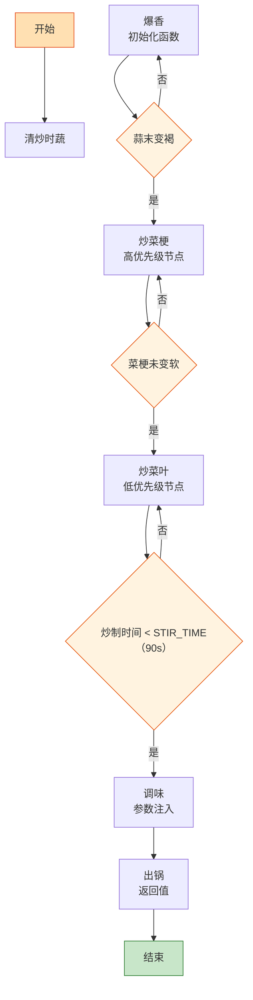

# 清炒时蔬

> 📐 **度量标准**：本菜谱所有模糊表述（块/勺/火候/油温/熟度）均以[_spec.md（度量标准库）](_spec.md) 为准，可点击各章节锚点查看。
> 函数式编程的纯粹体现——输入（当季蔬菜）→ 处理（大火快炒）→ 输出（本味清甜），不加多余调料就是纯函数，食材本味就是返回值。

## 流程总览（Flowchart）

## 常量定义（Constants）

| 常量名 | 值 | 来源 |
| --- | --- | --- |
| FIRE_HIGH | 大火(200℃+，火焰包住锅底) | [_spec §3](_spec.md#heat) |
| OIL_60 | 五六成热(120-160℃，竹筷快速冒细泡) | [_spec §4](_spec.md#oil) |
| SALT | 半小勺(2.5ml，咖啡勺) | [_spec §2](_spec.md#measure) |
| SUGAR | 半小勺(2.5ml) | [_spec §2](_spec.md#measure) |
| GARLIC | 3瓣 | — |
| STIR_TIME | 90s | — |

## 食材清单（Input）

| 食材 | 用量 | 切配规格 | 备注 |
| --- | --- | --- | --- |
| 当季绿叶菜 | 400g | 整棵洗净，切段(4-5cm，手指长) | [_spec §1](_spec.md#size-spec)；可选：生菜/菜心/芥蓝/菠菜/小白菜 |
| 蒜 | 3瓣 | 切末(<2mm，细沙) | [_spec §1](_spec.md#size-spec) |
| 盐 | 半小勺(2.5ml) | — | [_spec §2](_spec.md#measure) |
| 糖 | 半小勺(2.5ml) | — | [_spec §2](_spec.md#measure)；提鲜不抢味 |

## 预处理（Preprocess）

- **洗菜（数据清洗）**：绿叶菜逐叶掰开，清水浸泡 3min 去泥沙，冲洗 2 遍后**彻底沥干**——带水下锅是这道菜最大的 bug，会导致出水变黄。沥干就像「输入校验」，不通过不进锅。
- **切配（结构化处理）**：沥干的菜切成段(4-5cm，手指长)，菜梗和菜叶分开放——菜梗难熟先下锅，菜叶易熟后下锅，这就像「优先级队列」，按烹饪难度排序入锅。
- 蒜切末(<2mm)。所有 Input 就绪后再开火。

## 主流程（Main Logic）

1. **爆香（初始化函数）**：热锅倒 1.5 勺(约 22ml)油，油温升至 OIL_60(五六成热)，下蒜末爆香约 20s——`if 蒜末变褐: 立即下菜`，焦蒜就是 null pointer。这一步是「初始化函数」，蒜香必须先释放到油里。

2. **炒菜梗（高优先级节点）**：转 FIRE_HIGH(大火)，先下菜梗翻炒 30s——菜梗纤维粗、难熟，必须先下锅，这就像「高优先级任务先调度」。`while 菜梗未变软: 大火翻炒`。

3. **炒菜叶（低优先级节点）**：下菜叶，继续 FIRE_HIGH(大火)快速翻炒——这就像 `for` 循环遍历数组，每片叶子都要均匀沾油受热。`while 炒制时间 < STIR_TIME(90s): 大火翻炒`，蔬菜从「生脆态」转为「断生态」是一个状态机：生→颜色变深→变软→断生，断生标准为颜色变深变软、无生涩味([_spec §5](_spec.md#done))。全程不超过 90s，超时就是内存泄漏（叶绿素流失变黄、维生素降解）。`if 菜太干: 沿锅边淋 1勺(15ml)清水`，产生蒸汽加速熟透。

4. **调味（参数注入）**：加入 SALT(半小勺盐)、SUGAR(半小勺糖提鲜)，大火翻炒 10s 均匀——清炒的核心是「少即是多」，盐打底、糖提鲜，不加重调料遮盖蔬菜本味。调味层次遵循「面向对象继承」：底味(盐)→主味(蔬菜本味清甜)→顶味(糖提鲜+蒜香)，子类继承父类风味再叠加。

5. **出锅（返回值）**：立即装盘，不要在锅里停留——余温会继续加热导致变黄，这就像「及时返回值」，到了终态立即 return。

## 翻车预警（Bug Report）

- ⚠️ **Bug: 蔬菜变黄出水** → 根因：炒太久 or 菜没沥干 or 火不够大。修复：FIRE_HIGH(大火)全程不超过 90s、菜彻底沥干、断生即出锅，`while 未断生: 炒; 一旦断生: break`。
- ⚠️ **Bug: 菜梗生、菜叶烂** → 根因：菜梗菜叶一起下锅。修复：菜梗先下锅炒 30s，再下菜叶，按优先级分阶段入锅。
- ⚠️ **Bug: 味道太淡 or 蔬菜本味被遮盖** → 根因：盐放多了 or 加了生抽蚝油等重调料。修复：SALT 仅半小勺，清炒只放盐和糖，蔬菜本味清甜就是最佳输出。

## 完成标准（Test Cases）

| 测试项 | 预期结果 | 判定方法 |
| --- | --- | --- |
| 视觉测试 | 蔬菜翠绿不黄、蒜香油亮、色泽自然 | 肉眼观察 |
| 口感测试 | 菜梗脆嫩、菜叶软滑、清甜本味、咸淡适中 | 品尝 |
| 状态测试 | 盘底无大量积水、仅留薄油、蔬菜不软塌 | 倾斜盘子观察 |
| 时间测试 | 从开火到出锅 ≤10min | 计时 |
