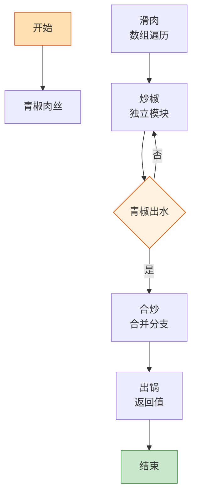

# 青椒肉丝

> 📐 **度量标准**：本菜谱所有模糊表述（块/勺/火候/油温/熟度）均以[_spec.md（度量标准库）](_spec.md) 为准，可点击各章节锚点查看。
> 程序员的 "Hello World" 菜谱——输入(肉丝+青椒)→处理(大火快炒)→输出(下饭菜)，15 分钟编译通过。

## 流程总览（Flowchart）

## 常量定义（Constants）

| 常量名 | 值 | 来源 |
| --- | --- | --- |
| FIRE_HIGH | 大火(200℃+，火焰包住锅底) | [_spec §3](_spec.md#heat) |
| OIL_60 | 五六成热(120-160℃，竹筷快速冒细泡) | [_spec §4](_spec.md#oil) |
| SOY_SAUCE | 1勺(15ml，汤勺) | [_spec §2](_spec.md#measure) |
| COOKING_WINE | 半勺(7.5ml，半汤勺) | [_spec §2](_spec.md#measure) |
| SALT | 1小勺(5ml，咖啡勺) | [_spec §2](_spec.md#measure) |
| SUGAR | 半小勺(2.5ml) | [_spec §2](_spec.md#measure) |
| STARCH | 1小勺(5ml) | [_spec §2](_spec.md#measure) |
| MARINATE_TIME | 10min | — |

## 食材清单（Input）

| 食材 | 用量 | 切配规格 | 备注 |
| --- | --- | --- | --- |
| 猪里脊 | 200g | 逆纹切丝(3mm宽×5cm长，火柴棍) | [_spec §1](_spec.md#size-spec) |
| 青椒 | 3个 | 去籽切丝(3mm宽×5cm长) | 选厚实不辣的菜椒 |
| 蒜 | 3瓣 | 切末(<2mm，细沙) | [_spec §1](_spec.md#size-spec) |
| 姜 | 2片 | 切末(<2mm) | 可选，去腥用 |

## 预处理（Preprocess）

- **腌肉（编译期优化）**：肉丝中加入 SOY_SAUCE(1勺生抽)、COOKING_WINE(半勺料酒)、STARCH(1小勺淀粉)，抓匀至肉丝表面起黏，腌制 MARINATE_TIME(10min)。淀粉在肉表面形成保护膜——这就是「预处理=去腥定型」，下锅后不易老。
- 青椒丝、蒜末备好，**所有 Input 就绪后再开火**（避免热锅等菜导致油温失控）。

## 主流程（Main Logic）

1. **滑肉（数组遍历）**：热锅倒油，油温升至 OIL_60(五六成热)，下肉丝快速滑散——这就像 `for` 循环遍历数组，每个元素（肉丝）都要均匀受热，粘连在一起就是未初始化的 bug。滑至变色（约 30s），盛出备用。

2. **炒椒（独立模块）**：锅留底油，调用 `[_spec §6](_spec.md#preprocess) 爆香()`（小火下蒜末炒出香味约 30s），转 FIRE_HIGH(大火)，下青椒丝炒至断生——颜色变深变软、无生涩味([_spec §5](_spec.md#done))。全程大火，`if 青椒出水: 立即出锅`，出水就是过度渲染。

3. **合炒（合并分支）**：倒入滑好的肉丝，加入 SALT(1小勺盐)、SUGAR(半小勺糖提鲜)、少许生抽，FIRE_HIGH(大火)快炒 30s 让味道 merge。调味层次遵循「面向对象继承」：底味(盐)→主味(生抽)→顶味(糖提鲜)，子类继承父类风味再叠加。

4. **出锅（返回值）**：装盘，盘底仅留薄油，无多余汤汁。

## 翻车预警（Bug Report）

- ⚠️ **Bug: 肉丝发柴** → 根因：顺纹切肉 or 未腌淀粉 or 滑肉超时。修复：逆纹切丝([_spec §1](_spec.md#size-spec))、淀粉腌制形成保护膜、变色即盛出。
- ⚠️ **Bug: 青椒出水变软塌** → 根因：小火慢炒 or 炒太久。修复：FIRE_HIGH(大火)快炒，断生即止，`while 青椒未断生: 翻炒; 一旦断生: break`。
- ⚠️ **Bug: 肉丝粘连成坨** → 根因：下锅后未立即滑散。修复：油温够 OIL_60 再下，下锅后用筷子快速拨散。

## 完成标准（Test Cases）

| 测试项 | 预期结果 | 判定方法 |
| --- | --- | --- |
| 视觉测试 | 肉丝洁白微焦、青椒翠绿油亮、色泽自然 | 肉眼观察 |
| 口感测试 | 肉丝嫩滑不柴、青椒脆爽、咸鲜适口 | 品尝 |
| 状态测试 | 盘底仅留薄油、无多余汤汁渗出 | 倾斜盘子观察 |
| 时间测试 | 从开火到出锅 ≤15min | 计时 |
