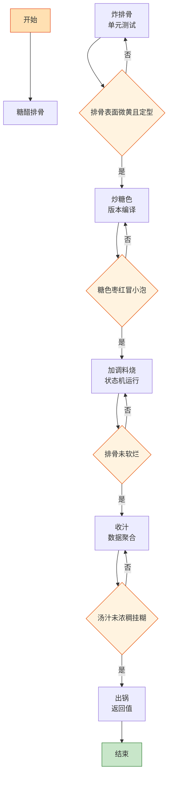

# 糖醋排骨

> 📐 **度量标准**：本菜谱所有模糊表述（块/勺/火候/油温/熟度）均以[_spec.md（度量标准库）](_spec.md) 为准，可点击各章节锚点查看。
> 酸甜口的「状态机」实现——炸排骨是单元测试定型，糖醋汁是状态迁移（稀→稠→挂糊），收汁是数据聚合，终态是每根排骨都裹着亮红的糖醋壳。

## 流程总览（Flowchart）

## 常量定义（Constants）

| 常量名 | 值 | 来源 |
| --- | --- | --- |
| FIRE_HIGH | 大火(200℃+，火焰包住锅底) | [_spec §3](_spec.md#heat) |
| FIRE_MEDIUM | 中火(160-180℃，火焰舔锅底一半) | [_spec §3](_spec.md#heat) |
| FIRE_LOW | 小火(120-140℃，火焰不舔锅底) | [_spec §3](_spec.md#heat) |
| OIL_60 | 五六成热(120-160℃，竹筷快速冒细泡) | [_spec §4](_spec.md#oil) |
| OIL_70 | 七八成热(160-200℃，竹筷冒大泡油面冒烟) | [_spec §4](_spec.md#oil) |
| SOY_SAUCE | 1勺(15ml，汤勺) | [_spec §2](_spec.md#measure) |
| VINEGAR | 3勺(45ml，汤勺) | [_spec §2](_spec.md#measure) |
| SUGAR | 3勺(45ml，汤勺) | [_spec §2](_spec.md#measure) |
| COOKING_WINE | 1勺(15ml，汤勺) | [_spec §2](_spec.md#measure) |
| SALT | 半小勺(2.5ml) | [_spec §2](_spec.md#measure) |
| STARCH | 1小勺(5ml) | [_spec §2](_spec.md#measure) |
| SIMMER_TIME | 15-20min | — |

## 食材清单（Input）

| 食材 | 用量 | 切配规格 | 备注 |
| --- | --- | --- | --- |
| 猪小排 | 400g | 剁块(3cm见方，麻将牌) | [_spec §1](_spec.md#size-spec)，选肋排 |
| 白糖 | 3勺(45ml) | — | 糖醋汁主料，也可用冰糖 |
| 香醋 | 3勺(45ml) | — | 糖醋汁灵魂，用香醋不用白醋 |
| 生抽 | 1勺(15ml) | — | 提鲜上色 |
| 料酒 | 1勺(15ml) | — | 去腥 |
| 姜 | 1块 | 切片(2-3mm厚，1元硬币厚度) | [_spec §1](_spec.md#size-spec) |
| 葱 | 2根 | 切段(4-5cm，手指长) | [_spec §1](_spec.md#size-spec) |
| 蒜 | 3瓣 | 切片(2-3mm厚) | [_spec §1](_spec.md#size-spec) |
| 白芝麻 | 1小勺(5ml) | — | 出锅撒，增香点缀 |
| 淀粉 | 1小勺(5ml) | 调水淀粉 | [_spec §2](_spec.md#measure) |

## 预处理（Preprocess）

- **焯水（初始化清理）**：排骨冷水下锅，加入姜片、葱段、COOKING_WINE(半勺料酒)，FIRE_HIGH(大火)烧开撇沫，煮 3min 捞出沥干——调用 `[_spec §6](_spec.md#preprocess) 焯水()`，去除血水去腥。
- **调糖醋汁（配置文件）**：碗中加入 VINEGAR(3勺香醋)、SUGAR(3勺白糖)、SOY_SAUCE(1勺生抽)、SALT(半小勺盐)、清水1碗(250ml)，搅匀备用——糖醋汁是「配置文件」，醋:糖=1:1 是核心比例，所有参数提前配好。
- 蒜片、姜片、葱段备好。

## 主流程（Main Logic）

1. **炸排骨（单元测试）**：热锅倒油，油温 OIL_60(五六成热)，下焯好沥干的排骨，炸至表面微黄定型（约 3min），捞出控油——炸排骨是「单元测试」，先验证每块排骨的结构完整性，表面定型后后续烧的时候不散。`if 排骨表面微黄且定型: 捞出`。

   > 不炸版：可以用 FIRE_MEDIUM(中火)煸炒至表面微黄，更健康但香味略差。

2. **炒糖色（版本编译）**：锅留底油，下 SUGAR(1勺白糖)，FIRE_LOW(小火)慢慢熬至枣红色冒小泡（状态机：白糖→融化→冒小泡→枣红），立即下炸好的排骨翻炒上色——炒糖色是「版本编译」，精确控制在枣红色瞬间下肉，`if 糖色枣红冒小泡: 下排骨; if 冒大泡: 过了会苦`。

3. **加调料烧（状态机运行）**：加入 COOKING_WINE(半勺料酒)、姜片、蒜片、葱段，翻炒均匀，倒入提前配好的糖醋汁，FIRE_HIGH(大火)烧开后转 FIRE_LOW(小火)，盖上锅盖慢烧 SIMMER_TIME(15-20min)——状态机：`生→定型→上色→吸味→软烂`，`while 排骨未软烂: 保持微沸`，中途翻一次防止糊底。终态是筷子能轻松插透排骨([_spec §5](_spec.md#done))。

4. **收汁（数据聚合）**：炖至排骨软烂，转 FIRE_HIGH(大火)，`while 汤汁未浓稠挂糊: 翻动收汁`，持续 3-5min，至汤汁浓稠可挂勺挂糊([_spec §5](_spec.md#done))、均匀包裹每根排骨。收汁是「数据聚合」，将分散在汤汁中的酸甜味道浓缩到排骨表面，`if 汤汁挂糊且排骨亮红: 立即出锅`，收汁过度会糊锅发苦。

5. **出锅（返回值）**：装盘，撒白芝麻(1小勺)点缀。

## 翻车预警（Bug Report）

- ⚠️ **Bug: 糖醋味不够/比例失调** → 根因：醋糖比例不对 or 用了白醋。修复：醋:糖=1:1（各3勺）、用香醋不用白醋、糖醋汁提前配好。
- ⚠️ **Bug: 排骨不烂** → 根因：烧的时间不够 or 火太大。修复：小火慢烧 15-20min、筷子能插透再收汁、中途只加开水。
- ⚠️ **Bug: 颜色不够红亮** → 根因：糖色炒浅了 or 收汁不够。修复：糖色炒到枣红色、大火收汁至浓稠挂糊、生抽提色。
- ⚠️ **Bug: 太酸或太甜** → 根因：醋糖比例不对。修复：严格 1:1、收汁时尝一下，太酸加少许糖、太甜加少许醋。
- ⚠️ **Bug: 糊锅** → 根因：收汁时火太大 or 没翻动 or 收汁过度。修复：大火收汁但持续翻动、挂糊立即出锅、不要烧干。

## 完成标准（Test Cases）

| 测试项 | 预期结果 | 判定方法 |
| --- | --- | --- |
| 视觉测试 | 排骨均匀裹汁、色泽红亮、表面挂有浓稠糖醋壳、芝麻点缀 | 肉眼观察 |
| 口感测试 | 排骨软烂脱骨、酸甜平衡、外裹浓汁内里入味 | 品尝 |
| 状态测试 | 汤汁浓稠挂糊、盘底无大量游离汤汁、排骨不渗油 | 舀起观察挂糊度 |
| 时间测试 | 从焯水到出锅 ≤40min | 计时 |
