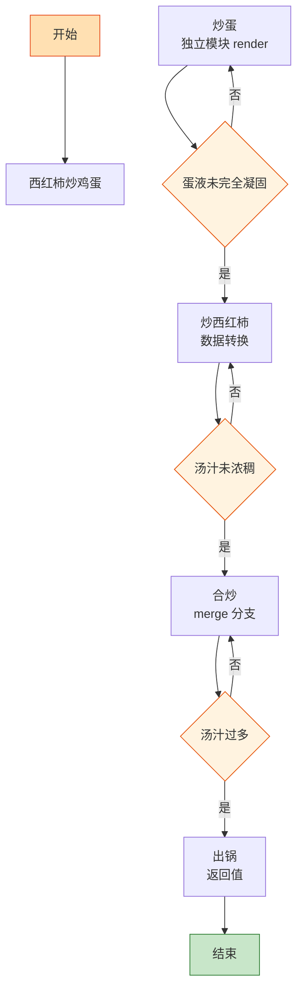

# 西红柿炒鸡蛋

> 📐 **度量标准**：本菜谱所有模糊表述（块/勺/火候/油温/熟度）均以[_spec.md（度量标准库）](_spec.md) 为准，可点击各章节锚点查看。
> 国民级 "Hello World"——两个 Input（鸡蛋+西红柿）经过两次独立 render 后 merge，酸甜咸鲜一次编译通过。

## 流程总览（Flowchart）

## 常量定义（Constants）

| 常量名 | 值 | 来源 |
| --- | --- | --- |
| FIRE_HIGH | 大火(200℃+，火焰包住锅底) | [_spec §3](_spec.md#heat) |
| FIRE_MID | 中火(160-180℃，火焰舔锅底一半) | [_spec §3](_spec.md#heat) |
| OIL_60 | 五六成热(120-160℃，竹筷快速冒细泡) | [_spec §4](_spec.md#oil) |
| SALT | 1小勺(5ml，咖啡勺) | [_spec §2](_spec.md#measure) |
| SUGAR | 1小勺(5ml) | [_spec §2](_spec.md#measure) |
| SOY_SAUCE | 半勺(7.5ml，半汤勺) | [_spec §2](_spec.md#measure) |
| OIL_EGG | 2勺(30ml，2汤勺) | [_spec §2](_spec.md#measure) |
| STARCH_WATER | 淀粉:水=1:3 | [_spec §6](_spec.md#preprocess) |

## 食材清单（Input）

| 食材 | 用量 | 切配规格 | 备注 |
| --- | --- | --- | --- |
| 鸡蛋 | 3个 | 打散至蛋液均匀 | 加1小勺(5ml)清水更嫩 |
| 西红柿 | 2个(约300g) | 切块(2cm见方，骰子大) | [_spec §1](_spec.md#size-spec)；选熟透红软的 |
| 葱 | 1根 | 切粒(5mm，米粒) | [_spec §1](_spec.md#size-spec) |
| 蒜 | 2瓣 | 切末(<2mm，细沙) | [_spec §1](_spec.md#size-spec) |

## 预处理（Preprocess）

- **蛋液预处理（编译期优化）**：鸡蛋打入碗中，加 SALT(半小勺盐)、1小勺(5ml)清水，用筷子顺一个方向搅打 30s 至蛋液均匀无蛋清结块——加水是「稀释缓冲」，下锅后蛋体更蓬松嫩滑。
- 西红柿切块(2cm见方)，葱切粒、蒜切末，所有 Input 就绪后再开火。

## 主流程（Main Logic）

1. **炒蛋（独立模块 render）**：热锅倒 OIL_EGG(2勺油)，油温升至 OIL_60(五六成热)，倒入蛋液——`while 蛋液未完全凝固: 用锅铲从边缘向中心推`，这就像 `for` 循环逐行渲染画布，每推一次凝固一层。蛋液凝固成大块（约 40s），立即盛出备用，`if 炒至碎末: return error`，大块才是正确输出。

2. **炒西红柿（数据转换）**：锅留底油，调用 `[_spec §6](_spec.md#preprocess) 爆香()`（小火下蒜末炒出香味约 30s），转 FIRE_HIGH(大火)，下西红柿块翻炒 1min 至出汁——西红柿从「固态块」转为「酱汁态」是一个状态机：生块→变软→出汁→浓稠，`while 汤汁未浓稠: 继续翻炒`。加入 SUGAR(1小勺糖)中和酸味、SALT(半小勺盐)打底、SOY_SAUCE(半勺生抽)提鲜。

3. **合炒（merge 分支）**：倒入炒好的鸡蛋，用锅铲将鸡蛋切成适口大块，FIRE_MID(中火)翻炒 30s 让鸡蛋吸饱西红柿汁——调味层次遵循「面向对象继承」：底味(盐)→主味(西红柿酸甜)→顶味(糖提鲜)，子类继承父类风味再叠加。`if 汤汁过多: 大火收汁 20s`。

4. **出锅（返回值）**：撒葱粒，装盘。

## 翻车预警（Bug Report）

- ⚠️ **Bug: 鸡蛋炒老发柴** → 根因：油温不够 or 炒太久。修复：OIL_60 再下蛋液，凝固成大块立即盛出，`while 蛋液未凝固: 推; 一旦凝固: break`。
- ⚠️ **Bug: 西红柿不出汁、汤水寡淡** → 根因：西红柿没熟透 or 大火快炒没焖。修复：选红软熟透的西红柿，切块后大火炒出汁再中火焖 1min。
- ⚠️ **Bug: 味道只有酸没有鲜** → 根因：只放了盐没放糖。修复：SUGAR(1小勺糖)是关键，酸甜平衡才是正确输出。

## 完成标准（Test Cases）

| 测试项 | 预期结果 | 判定方法 |
| --- | --- | --- |
| 视觉测试 | 鸡蛋金黄大块、西红柿红亮出汁、色泽诱人 | 肉眼观察 |
| 口感测试 | 鸡蛋嫩滑、西红柿绵软、酸甜平衡咸鲜适口 | 品尝 |
| 状态测试 | 汤汁浓稠可挂勺、鸡蛋块完整不碎 | 倾斜盘子观察 |
| 时间测试 | 从开火到出锅 ≤15min | 计时 |
