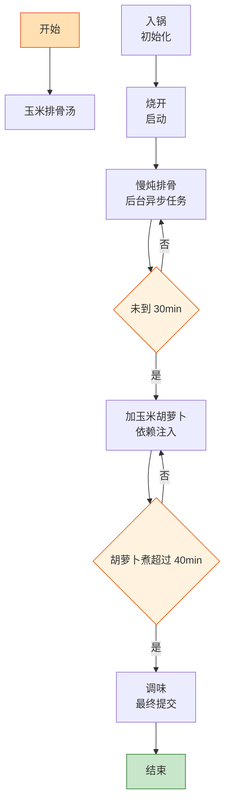

# 玉米排骨汤

> 📐 **度量标准**：本菜谱所有模糊表述（块/勺/火候/油温/熟度）均以[_spec.md（度量标准库）](_spec.md) 为准，可点击各章节锚点查看。
> 甜党汤羹的 "依赖注入"——排骨先炖出底味，玉米胡萝卜后注入甜度，分阶段加载，终态=汤色金黄、清甜醇厚。

## 流程总览（Flowchart）

## 常量定义（Constants）

| 常量名 | 值 | 来源 |
| --- | --- | --- |
| FIRE_HIGH | 大火(200℃+，火焰包住锅底) | [_spec §3](_spec.md#heat) |
| FIRE_LOW | 小火(120-140℃，火焰不舔锅底) | [_spec §3](_spec.md#heat) |
| STEW_RIB_TIME | 30min(排骨先炖) | — |
| STEW_TOTAL_TIME | 60min | — |
| WATER | 6碗(1500ml，标准饭碗) | [_spec §2](_spec.md#measure) |
| SALT | 1小勺(5ml，咖啡勺) | [_spec §2](_spec.md#measure) |
| COOKING_WINE | 1勺(15ml，汤勺) | [_spec §2](_spec.md#measure) |
| GINGER | 5片(2-3mm厚，1元硬币厚度) | [_spec §1](_spec.md#size-spec) |

## 食材清单（Input）

| 食材 | 用量 | 切配规格 | 备注 |
| --- | --- | --- | --- |
| 猪肋排 | 400g | 剁段(4-5cm，手指长) | [_spec §1](_spec.md#size-spec)，选肥瘦相间肋排 |
| 甜玉米(水果玉米) | 2根 | 剁段(4-5cm，手指长) | [_spec §1](_spec.md#size-spec)，甜玉米比糯玉米更适合煮汤 |
| 胡萝卜 | 1根(约200g) | 切滚刀块(3cm见方，麻将牌) | [_spec §1](_spec.md#size-spec) |
| 姜 | 1块 | 切片(2-3mm厚)，5片 | [_spec §1](_spec.md#size-spec) |
| 葱 | 2根 | 切段(4-5cm)，1根垫底1根撒葱花 | [_spec §1](_spec.md#size-spec) |
| 料酒 | 1勺(15ml) | — | 焯水去腥 |
| 盐 | 1小勺(5ml) | — | 出锅前放 |
| 清水 | 6碗(1500ml) | — | — |

## 预处理（Preprocess）

- **焯水()**：调用 `[_spec §6](_spec.md#preprocess) 焯水()`——排骨段冷水下锅，加 COOKING_WINE(1勺料酒)+姜片(2片)，煮开撇去浮沫，捞出用温水冲洗干净。焯水是「编译期优化」，去除血水和骨渣，避免汤浑浊。
- **玉米剁段**：甜玉米剥去外衣和玉米须，剁成 4-5cm 段——玉米段的切口能让甜味更好地释放到汤中。
- **胡萝卜切滚刀块**：胡萝卜去皮，切滚刀块(3cm见方)——滚刀块增大受热面积，炖煮时甜味释放更均匀。

## 主流程（Main Logic）

1. **入锅（初始化）**：焯好的排骨放入砂锅，加入姜片(剩余 3 片)、葱段(1 根)，倒入 WATER(6碗清水)——初始化炖煮环境，水量一次加足，中途不加水(加水=热插拔，温度骤降导致汤味变淡)。

2. **烧开（启动）**：FIRE_HIGH(大火)烧开，用勺子撇去表面残余浮沫——清除编译期 warning，浮沫=蛋白质变性杂质，不撇会导致汤色浑浊。

3. **慢炖排骨（后台异步任务）**：转 FIRE_LOW(小火)，盖盖炖 STEW_RIB_TIME(30min)——慢炖=后台异步任务，排骨中的胶原蛋白和脂肪持续溶出，为汤底提供醇厚底味。`while 未到 30min: 保持微沸`，中途不频繁揭盖(线程阻塞)。

4. **加玉米胡萝卜（依赖注入）**：30min 后加入玉米段和胡萝卜块，继续小火炖 30min——玉米和胡萝卜是后注入模块(Dependency Injection)，它们的甜度和维生素需要时间释放，但比排骨易熟，所以分阶段加入(类似生命周期管理：先加载核心模块，再加载扩展模块)。`if 胡萝卜煮超过 40min: 开始烂糊(内存溢出)`，30min 刚好软甜又保持形状。

5. **调味（最终提交）**：出锅前加入 SALT(1小勺盐)，搅拌溶解——盐是最后提交的变更(Commit)，早放会使排骨蛋白质收缩、肉质发柴。这道菜突出清甜，盐量比咸鲜汤少 1/3，1 小勺刚好提味不抢甜。

## 翻车预警（Bug Report）

- ⚠️ **Bug: 汤不甜/玉米味淡** → 根因：用了糯玉米(不甜) or 玉米炖的时间不够 or 玉米不新鲜。修复：选甜玉米(水果玉米，颗粒饱满透亮)，玉米至少炖 30min 释放甜味，新鲜玉米比冷冻玉米甜。
- ⚠️ **Bug: 排骨发柴/塞牙** → 根因：早放盐 or 大火猛煮。修复：出锅前才放盐，全程小火微沸(大火只用于烧开阶段)，排骨炖足 60min。
- ⚠️ **Bug: 汤油腻/表面浮油厚** → 根因：排骨脂肪多 or 没焯水 or 没撇油。修复：选肥瘦相间的肋排(不要全肥)，焯水去血沫，炖好后可撇去表面浮油(用勺子轻轻撇)。

## 完成标准（Test Cases）

| 测试项 | 预期结果 | 判定方法 |
| --- | --- | --- |
| 视觉测试 | 汤色金黄清亮、玉米金黄饱满、胡萝卜橙红、排骨骨肉相连不碎 | 肉眼观察 |
| 口感测试 | 排骨酥烂、玉米甜糯多汁、胡萝卜软甜、汤清甜醇厚不腻 | 品尝 |
| 状态测试 | 排骨筷子可轻松插透([_spec §5](_spec.md#done) 肉类熟透)、玉米咬开无硬芯、胡萝卜软糯不糊化、汤面无浮沫 | 筷子插入+品尝 |
| 时间测试 | 从入锅到出锅约 60-70min | 计时 |
